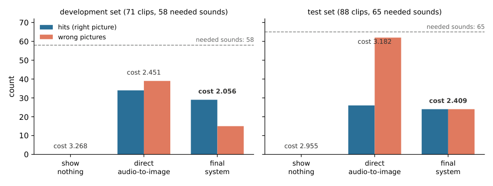

# Unseen Sounds Visualizer

**Visual Augmentation of Audio Semantics for Accessibility**: visualises off-screen sounds in video as generated images, for deaf and hard-of-hearing viewers.

MSc final project, Bar-Ilan University (Department of Computer Science), Adam Gavriely, 2026.
Supervisor: Dr Idan Schwartz.

Subtitles carry speech, but a deaf or hard-of-hearing viewer still misses the other sounds of a video: a siren
behind the camera, a dog barking in the next room, glass breaking off screen. This system watches a video, detects
its non-speech, non-music sounds, decides for each one whether its source is already visible, and shows a generated
picture of the sound beside the video **only while an off-screen sound is heard**. No model is trained: the system
is a chain of open models joined by hand-written rules, developed in 66 pre-registered rounds over more than 150
full-pipeline variants and more than 30 open models, and scored on 309 labelled sounds in 158 clips.

The full description, the benchmark, the results and the limits are in the technical report,
[`docs/report/report.pdf`](docs/report/report.pdf).

## Results



Scored per sound against human labels. A hit is the right kind of sound with a picture starting between 0.5 s
before and 1 s after it; cost = (4 × missed + 2 × wrong pictures) / clips, lower is better. The baselines are those
of the project proposal.

| system | development set (71 clips) | test set (87 clips) |
|---|---|---|
| show nothing | cost 3.268 | cost 3.034 |
| direct audio-to-image (and audio captioning) | 34 / 58 found, 39 wrong, cost 2.451 | 28 / 66 found, 59 wrong, cost 3.103 |
| v1.3.11 (the system of the report) | 29 / 58 found, 15 wrong, cost 2.056 | 25 / 66 found, 22 wrong, cost 2.391 |
| v1.4 | 31 / 58 found, 12 wrong, cost 1.859 | 28 / 66 found, 22 wrong, cost 2.253 |
| v1.5 | 31 / 58 found, 10 wrong, cost 1.803 | 28 / 66 found, 17 wrong, cost 2.138 |
| v1.6 | 31 / 58 found, 7 wrong, cost 1.718 | 28 / 66 found, 12 wrong, cost 2.023 |
| **v1.7 (this release)** | **31 / 58 found, 4 wrong, cost 1.634** | **28 / 66 found, 9 wrong, cost 1.954** |

v1.4 also keeps each picture on screen for more of its sound: a picture that finds its sound covers on average 83 % of
it on the development set (v1.3.11: 72 %). v1.5 finds the same sounds as v1.4 with 7 fewer wrong pictures, and v1.6 the same
sounds as v1.5 with 8 fewer (19 instead of 27 over the 158 clips). In a clip-grouped 5-fold cross-validation (5 fold
seeds) that switches each of the three v1.6 rules on or off inside every training fold, the held-out pictures lose no
sound and have 20 wrong pictures instead of 27 (cost 1.899 vs 1.987 over the 158 clips). v1.7 finds the same sounds
as v1.6 with 6 fewer wrong pictures (13 instead of 19); choosing its bar inside each training fold of a clip-grouped
5-fold cross-validation gives the same 13. The last five rows are reproduced from a plain clone by `python benchmark/gold/v14_score.py` (see below). Five test labels were corrected on a blind second listen, and every
system was re-scored on the corrected labels (the earlier labels are kept in `benchmark/gold/annotations/`). The
report describes v1.3.11; its limits are discussed in Section 9 of the report.

## How it works

1. **Audio and context**: extract the audio track, sample frames, detect visible objects (OWLv2) and transcribe speech.
2. **Sound detection**: BEATs and FlexSED propose sound events; the Qwen3-Omni and Audio Flamingo Next listeners,
   DASM and FineLAP confirm or reject them.
3. **On-screen check**: Qwen3.8-27B looks at the frames of each stretch of a sound and answers three questions; the
   a/b question ("could that thing be what is making the sound?", asked in both orders) decides whether the source is
   visible, and the majority of the three decides when the two orders disagree. A sound that comes in several bursts
   and whose source the check named on screen in any stretch is drawn for its first burst only (repeat lock). Because the frames are about one per
   second, a short visible flash (lightning, a blast: a luminance jump of at most four frames) is detected separately
   and silences a Thunder picture, or an Explosion / Fireworks / Gunshot picture that starts within 0.3 s of it.
4. **Pictures**: Qwen-Image-2512 draws each off-screen sound; a vision model checks the picture and it is redrawn up to five
   times. An alarm-type sound is drawn on the thing it belongs to (a siren as an emergency vehicle with its siren going off).
5. **Composition**: the pictures are shown beside the video while their sound plays. A picture stays on screen
   while FlexSED still hears its sound (score 0.5 or more, gaps under 1 s bridged). Generic texture labels
   (Vehicle, Water, Engine, Rain, Wind, Liquid, Mechanisms, Domestic sounds) are not drawn, and neither is a sound
   that no second detector can check (a family that neither FlexSED nor DASM has a query for, such as Shofar;
   `UNVERIFIABLE_FAMILIES` in `config.py`). Three rules then read the BEATs, FlexSED and DASM curves of each
   picture's sound around its start (from 0.25 s before to 0.75 s after it; the rise is that peak minus the median of
   the 2.5 s ending 0.5 s before the start): of two overlapping pictures of different sounds that start at most 3 s
   apart, the one the three detectors hear less at its start is dropped; a picture with detector confidence under
   0.41 whose FlexSED curve rises by less than 0.2 is dropped; and a picture whose BEATs curve does not rise at its
   start is dropped. Last, a picture that was drawn although the on-screen check voted "seen" in at least one stretch
   (by the majority of its three questions or by the description) must be heard by DASM (family score 0.6 or more
   somewhere inside the picture), or it is dropped (`src/stage6_visual_augmentation/v16.py`).

## Installation

```
git clone https://github.com/adamgavriely/unseen-sounds-visualizer && cd unseen-sounds-visualizer
python3.11 -m venv ~/venv_ms && source ~/venv_ms/bin/activate
pip install -r requirements.txt --extra-index-url https://download.pytorch.org/whl/cu121
git clone https://github.com/JHU-LCAP/FlexSED ~/FlexSED
git clone https://github.com/cai525/Transformer4SED ~/Transformer4SED
python3.11 -m venv ~/venv_flap
~/venv_flap/bin/pip install --no-deps -r requirements_finelap.txt --extra-index-url https://download.pytorch.org/whl/cu121
cp .env.example .env        # then set the paths and HF_TOKEN
python download_models.py
python -m pytest            # 11 tests, CPU only
```

- Python 3.11 with PyTorch 2.5.1 and transformers 5.16.1; `requirements.txt` lists every package with the version
  used. FFmpeg must be on the path.
- One GPU with about 80 GB of memory (an NVIDIA H200 was used; two A100 80 GB cards also work). Qwen-Image alone
  needs about 57 GB in bf16.
- `download_models.py` downloads every Hugging Face model the final system loads (about 200 GB), including the ones
  the detectors load inside their own code: CLAP (`laion/clap-htsat-unfused`, FlexSED), `roberta-base` (FineLAP),
  `bert-base-uncased` (DASM; point `BERT_DIR` at its snapshot folder) and `sentence-transformers/all-mpnet-base-v2`
  (the listener answers). PANNs downloads its CNN14 checkpoint to `~/panns_data/` on first use, so run `main.py`
  once online or place `Cnn14_DecisionLevelMax.pth` there; after that, `main.py` runs offline (`HF_HUB_OFFLINE=1`).
  DASM reads its weights from the Transformer4SED folder: put the files of `CPF2/detect_any_sound` in
  `$T4SED_ROOT/pretrained_model/detect_any_sound/text_query/` (`as_full_text_query_best_model.pt`, `config.yaml`). It also makes two cache fixes that
  PyTorch 2.5.1 needs: transformers 5.x refuses `.bin` weights with PyTorch older than 2.6, so CLAP is loaded from its
  safetensors conversion (same weights), and FineLAP's `roberta-base` is made available under that old name.
  If CLAP's tokenizer files or its safetensors weights are missing, FlexSED does not stop with an error: it gives
  about 0.006 for every sound and detects nothing. A run in which all FlexSED scores are the same means the CLAP
  download is incomplete.
- FineLAP runs in its own environment with transformers 4.51.3 (`requirements_finelap.txt`, every package pinned).
  Install it with `--no-deps`: letting pip resolve upgrades torch and breaks torchaudio and cuDNN in that environment.
- The final system also needs these outside repositories and environments. Their locations are read from environment
  variables (see [`.env.example`](.env.example)); export them in the shell before running `main.py`.

| what | used for | variable |
|---|---|---|
| FlexSED repository | second sound detector | `FLEXSED_ROOT` (default `~/FlexSED`) |
| Transformer4SED repository ([github.com/cai525/Transformer4SED](https://github.com/cai525/Transformer4SED)) with the DASM weights and `third_parties/MGA-CLAP`, plus a local `bert-base-uncased` | DASM, the third listener | `T4SED_ROOT` (default `~/Transformer4SED`), `BERT_DIR` (default `~/bert-base-uncased`) |
| a second Python environment with transformers 4.51.3, for FineLAP ([huggingface.co/AndreasXi/FineLAP](https://huggingface.co/AndreasXi/FineLAP)) | FineLAP veto | `FINELAP_PYTHON` (default `~/venv_flap/bin/python`) |

  Only for variants that the final system does not use: PretrainedSED (`PSED_ROOT`), FLAM (the `openflam` package,
  in its own environment) and the EAT / SSLAM taggers.

## Usage

```
python main.py --input data/input/clip.mp4 --device cuda
```

This writes `data/output/clip_augmented.mp4` (the video with the picture panel) and the intermediate files under
`data/work/clip/`. The final system is the configuration `config.use_shipped()` in [`config.py`](config.py).
Before detection, `main.py` prepares the listener inputs of the clip on the spot (FlexSED, BEATs and PANNs scores,
the two audio-language listeners, DASM and FineLAP), with `benchmark/gold/clip_prep.py`, once per clip
(the chain is listed in [`benchmark/gold/README.md`](benchmark/gold/README.md)). On first use it also computes DASM's
text queries once (`src/stage4_audio_event_detection/dasm_infer.py` → `data/work/dasm_text_queries.pt`).
Run time: about five minutes of GPU time (one NVIDIA H200) to prepare the listener inputs of a 15-s clip, plus the
picture step (about 20 s per picture try, up to five tries per picture). For a folder of clips, run `python main.py`
once per clip.

## Reproducing the numbers

The v1.7, v1.6, v1.5, v1.4 and v1.3.11 numbers of the table above, from a plain clone, on CPU, in a few seconds:

```
python benchmark/gold/v14_score.py              # v1.7
python benchmark/gold/v14_score.py --v1.6       # the same inputs with the v1.7 rule switched off
python benchmark/gold/v14_score.py --v1.5       # ... and the v1.6 rules
python benchmark/gold/v14_score.py --v1.4       # ... and the v1.5 rules
python benchmark/gold/v14_score.py --v1.3.11    # ... and the v1.4 rules
```

It reads the stage-5 outputs of the 158 benchmark clips and the per-clip inputs of the v1.4 to v1.7 rules (flash times,
FlexSED family curves, the BEATs / FlexSED / DASM family curves of the drawn sounds, durations, grouping answers) from [`benchmark/gold/v14/`](benchmark/gold/v14/), applies the
system's own on-screen decision and display code under `config.use_shipped()`, and scores the pictures with
`benchmark/gold/score_per_sound.py` against `benchmark/gold/annotations/gold_AG.json`.

The report's numbers (v1.3.11) are stored in the repository:
[`benchmark/gold/final_vs_baselines.json`](benchmark/gold/final_vs_baselines.json) (final system and baselines),
[`benchmark/gold/final_vs_baselines_extra.json`](benchmark/gold/final_vs_baselines_extra.json) (F1 intervals,
danger sounds) and [`docs/decision_trail/data_parity.json`](docs/decision_trail/data_parity.json) (configuration check).
Appendix C of the report gives the source file of every number.

Checks that run from a plain clone, on CPU, in under a minute: `python -m pytest` (11 tests);
`python benchmark/gold/parity_check.py SHIP8+MD3+WW5+SL` (the shipped configuration equals the scored variant);
`python benchmark/gold/holm_five.py` (the Holm correction over the five main tests);
`python docs/report/figures/make_results_figure.py` (rebuilds `results_bars.pdf` and `.png` from the numbers of Table 3, written in the script).

Recomputing them from a clone is not possible as is. The scripts (for example
`python benchmark/gold/final_vs_baselines.py`) read the stage-5 outputs of every benchmark clip (under `data/work/`)
and the cached model answers of the development and test sets. The listener and grouping answers
(`benchmark/gold/*_listener*.json`, `benchmark/gold/grp/`) are in the source tree of release v1.2.0
(`git fetch --tags && git checkout v1.2.0 -- benchmark/gold`); the stage outputs under `data/work/` are not
redistributed and are rebuilt from the clips with `benchmark/gold/clip_prep.py`. The clips are not redistributed either (their
source collections are listed in the "Data" section (Section 4) and the "Code and data availability" note of the
report). The clip names are in `benchmark/gold/dev_stems.txt` (71) and `test_stems.txt` (87); the human labels are
in `benchmark/gold/annotations/gold_AG.json`. With the clips in their input folders (paths in
`benchmark/gold/clip_prep.py` and `benchmark/run_protocol.py`), `benchmark/gold/clip_prep.py` builds the model
inputs (step order in [`benchmark/gold/README.md`](benchmark/gold/README.md)), then the scripts above run.
Some files were renamed after release v1.2.0; the old-to-new name table is in
[`benchmark/gold/README.md`](benchmark/gold/README.md) ("Names in release v1.2.0").

## Repository layout

| path | content |
|---|---|
| `main.py`, `config.py` | entry point and configuration (`use_shipped()` = final system) |
| `requirements.txt`, `requirements_finelap.txt`, `download_models.py` | the two environments and the model download (see Installation) |
| `src/` | the pipeline, one package per stage (`stage1_…` to `stage7_…`) |
| `benchmark/` | human labels, per-sound scorer, scoring harness and the per-clip input builder (research rounds and listener answers: release v1.2.0) |
| `tests/` | unit tests |
| `docs/report/` | the technical report (LaTeX sources, figures and PDF) |
| `docs/decision_trail/` | decision trail: every decision of the final system on every clip, and its parity check |
| `comfyui_nodes/` | optional ComfyUI interface ([`comfyui_nodes/README.md`](comfyui_nodes/README.md)) |
| `data/input/` | a small synthetic test clip (plain frame, generated soundtrack) for the quick-start command |

To browse the decision trail, open `docs/decision_trail/index.html` in a browser (no server needed); the clip videos
are not in the repository, so the video box stays empty, but the trails, timelines and counts all work.

## Citation

See [`CITATION.cff`](CITATION.cff).

## License

The code is released under the [MIT License](LICENSE). The vendored BEATs code in `src/stage4_audio_event_detection/beats/` keeps its own licence (see the LICENSE file there). The video clips are not part of the repository.
